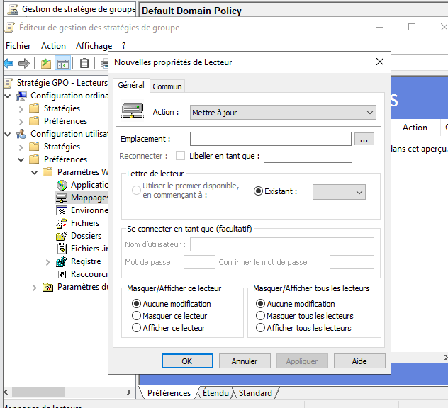
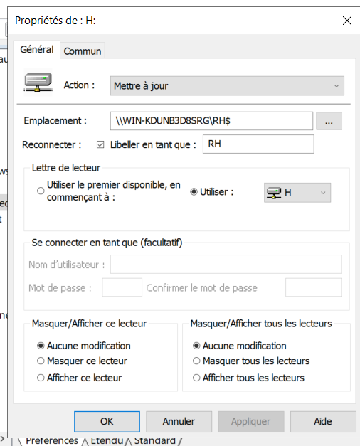
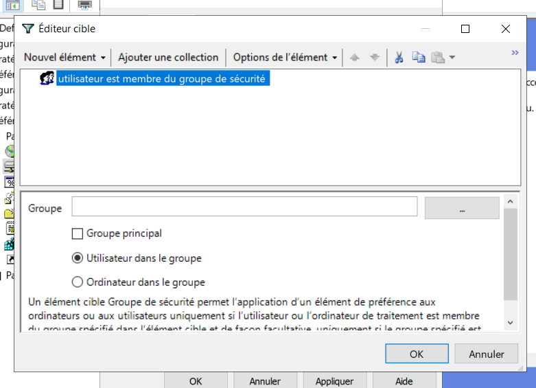
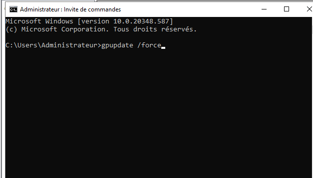

# 📋 Group Policy Objects (GPO)

> Mise en place et administration des stratégies de groupe
> dans un environnement Windows Server / Active Directory.

## 🎯 Objectif

L'objectif de cette partie est de mettre en place des stratégies
de groupe (GPO) afin de centraliser la configuration et la
sécurisation des postes clients et des utilisateurs du domaine.

Les GPO permettent notamment d'appliquer automatiquement des
paramètres aux utilisateurs et aux ordinateurs appartenant au
domaine Active Directory.

---

## 🖥️ Environnement

- Windows Server
- Active Directory
- Group Policy Management
- GPO
- Domaine `fotsing.local`
- Windows 10

---

# 🏗️ Organisation des GPO

Les stratégies de groupe sont organisées au niveau du domaine
et des différentes unités d'organisation (OU).
```text
fotsing.local
│
├── OU-Utilisateurs
│   ├── RH
│   ├── Direction
│   ├── Informatique
│   ├── Comptabilité
│   └── Stagiaire
│
├── OU-Ordinateurs
│
└── GPO
    ├── GPO-Securite
    ├── GPO-Utilisateurs
    └── GPO-Postes
```

# 1️⃣ Création du lecteur réseau

Nous commençons par préparer le lecteur réseau qui sera
accessible aux utilisateurs concernés.

<p align="center">  </p>

# 2️⃣ Création de la première GPO

Nous créons une première stratégie de groupe destinée à
notre projet.

<p align="center">  </p>

# 3️⃣ Création du lecteur mappé

Nous configurons ensuite le lecteur réseau qui sera déployé
automatiquement auprès des utilisateurs.

<p align="center">  </p>
🎯 Ciblage de la stratégie

# 4️⃣ Ciblage sur un groupe

Nous définissons un ciblage permettant d'appliquer la stratégie
uniquement aux utilisateurs appartenant au groupe concerné.

<p align="center">  </p>

Cette méthode permet d'éviter d'appliquer une GPO à l'ensemble
des utilisateurs du domaine.

# 5️⃣ Liaison de la GPO

Nous lions ensuite la GPO à l'objet ou à l'unité d'organisation
concernée.

<p align="center">  </p>

📁 Configuration du lecteur partagé

# 6️⃣ Définition de l'emplacement

Nous indiquons l'emplacement du lecteur réseau qui sera utilisé
par les utilisateurs.

<p align="center">  </p>

# 7️⃣ Ciblage du dossier partagé

Nous configurons le chemin vers le dossier partagé.

<p align="center">  </p>

# 8️⃣ Configuration du partage

Nous réalisons ensuite le ciblage du lecteur partagé afin que
la ressource soit accessible uniquement aux utilisateurs
concernés.

<p align="center">  </p>

🔄 Actualisation de la stratégie

# 9️⃣ Mise à jour de la stratégie de groupe

Après avoir configuré notre GPO, nous pouvons forcer la mise
à jour des stratégies sur le poste client.

La commande utilisée est :

gpupdate /force
<p align="center">  </p>

Cette commande permet de demander immédiatement au poste
client de récupérer les dernières stratégies disponibles.

🧪 Tests

Après l'application de la GPO, nous vérifions que la configuration
est bien prise en compte sur le poste client.

Vérifications réalisées
Application de la GPO
Présence du lecteur réseau
Accès au dossier partagé
Vérification des stratégies appliquées
Vérification avec gpresult /r
📸 Résultat

La stratégie de groupe permet de centraliser la configuration
des postes et des utilisateurs depuis Active Directory.

Le lecteur réseau est automatiquement configuré pour les
utilisateurs ciblés par la stratégie.

# 🧠 Compétences démontrées
Administration Windows Server
Active Directory
Group Policy Objects (GPO)
Group Policy Management
Gestion des utilisateurs
Gestion des OU
Configuration des postes clients
Lecteurs réseau
Partages Windows
gpupdate
gpresult
Administration centralisée

🔗 Navigation

[⬅️ Retour au projet principal](../../README.md)

[📁 dfs →](../dfs/README.md)