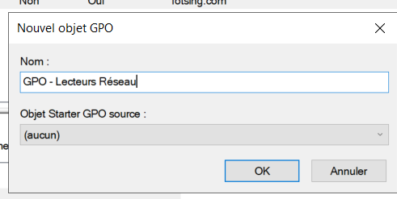
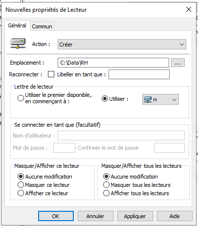
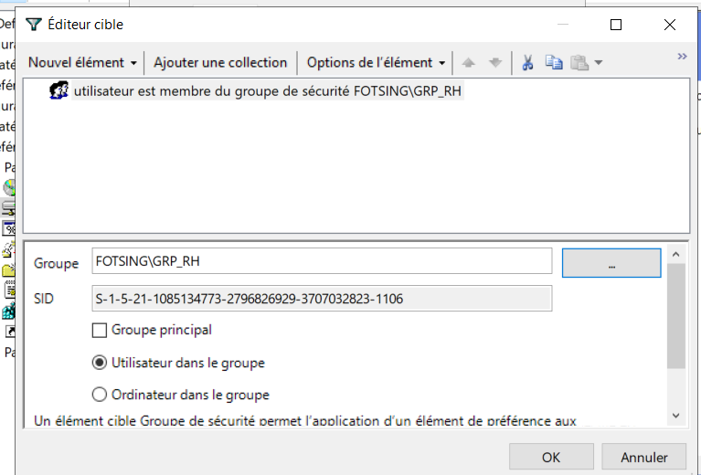

# 📋 Group Policy Objects (GPO)

> Mise en place et administration des stratégies de groupe
> dans un environnement Windows Server / Active Directory.

## 🎯 Objectif

L'objectif de cette partie est de mettre en place des stratégies
de groupe (GPO) afin de centraliser la configuration et la
sécurisation des postes clients et des utilisateurs du domaine.

Les GPO permettent notamment d'appliquer automatiquement des
paramètres aux utilisateurs et aux ordinateurs appartenant au
domaine Active Directory.

---

## 🖥️ Environnement

- Windows Server
- Active Directory
- Group Policy Management
- GPO
- Domaine `fotsing.local`
- Windows 10

---

# 🏗️ Organisation des GPO

Les stratégies de groupe sont organisées au niveau du domaine
et des différentes unités d'organisation (OU).
```text
fotsing.local
│
├── OU-Utilisateurs
│   ├── RH
│   ├── Direction
│   ├── Informatique
│   ├── Comptabilité
│   └── Stagiaire
│
├── OU-Ordinateurs
│
└── GPO
    ├── GPO-Securite
    ├── GPO-Utilisateurs
    └── GPO-Postes
```


#  Création d'une nouvelle GPO

Nous créons une nouvelle stratégie de groupe qui sera utilisée
pour appliquer une configuration spécifique aux postes ou aux
utilisateurs.

<p align="center">  </p>

#  Création d'une GPO liée à une OU

La GPO peut être liée à une unité d'organisation afin que les
paramètres soient appliqués uniquement aux utilisateurs ou
ordinateurs concernés.

<p align="center">  </p>

#  Configuration de la stratégie

Nous modifions ensuite les paramètres de la stratégie de groupe.

<p align="center">  </p>
👥 Ciblage des utilisateurs

#  Ciblage d'un groupe

Nous pouvons cibler une stratégie de groupe sur un groupe
d'utilisateurs spécifique.

Cette méthode permet d'appliquer une configuration uniquement
aux utilisateurs concernés.

<p align="center">  </p>
💻 Configuration des postes

#  Configuration du lecteur réseau

Dans cette partie, nous configurons un lecteur réseau qui pourra
être automatiquement accessible par les utilisateurs concernés.

<p align="center">  </p>

#  Définition de l'emplacement du lecteur

Nous définissons l'emplacement réseau qui sera utilisé par
la stratégie.

<p align="center">  </p>

#  Configuration du dossier partagé

Nous configurons ensuite le chemin du dossier partagé auquel
le lecteur réseau doit accéder.

<p align="center">  </p>
🧪 Application de la GPO

#  Mise à jour des stratégies

Après avoir configuré la GPO, nous pouvons forcer l'actualisation
des stratégies sur le poste client.

gpupdate /force

Cette commande permet de demander immédiatement au poste de
récupérer et d'appliquer les stratégies de groupe mises à jour.

🔎 Vérification

Nous pouvons vérifier les stratégies appliquées avec :

gpresult /r

Cette commande permet d'afficher les stratégies de groupe
appliquées à l'utilisateur et à l'ordinateur.

🧪 Tests

Après l'application de la GPO, nous vérifions que la configuration
est bien prise en compte sur le poste client.

Vérifications réalisées
Application de la GPO
Présence du lecteur réseau
Accès au dossier partagé
Vérification des stratégies appliquées
Vérification avec gpresult /r
📸 Résultat

La stratégie de groupe permet de centraliser la configuration
des postes et des utilisateurs depuis Active Directory.

Le lecteur réseau est automatiquement configuré pour les
utilisateurs ciblés par la stratégie.

# 🧠 Compétences démontrées
Administration Windows Server
Active Directory
Group Policy Objects (GPO)
Group Policy Management
Gestion des utilisateurs
Gestion des OU
Configuration des postes clients
Lecteurs réseau
Partages Windows
gpupdate
gpresult
Administration centralisée