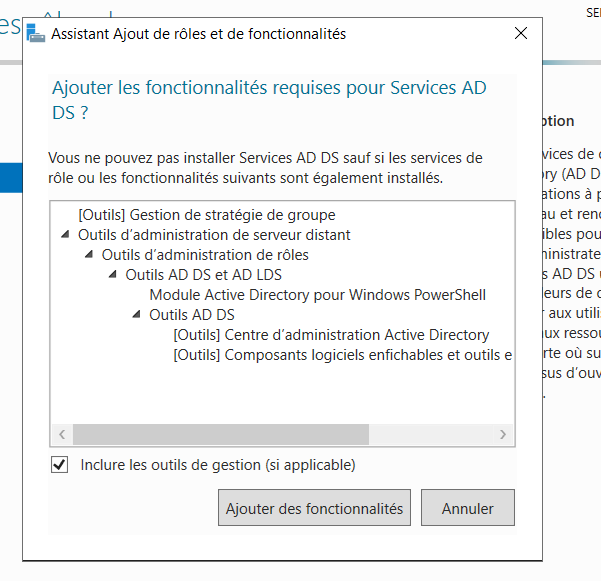
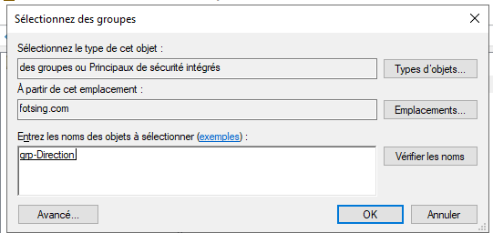
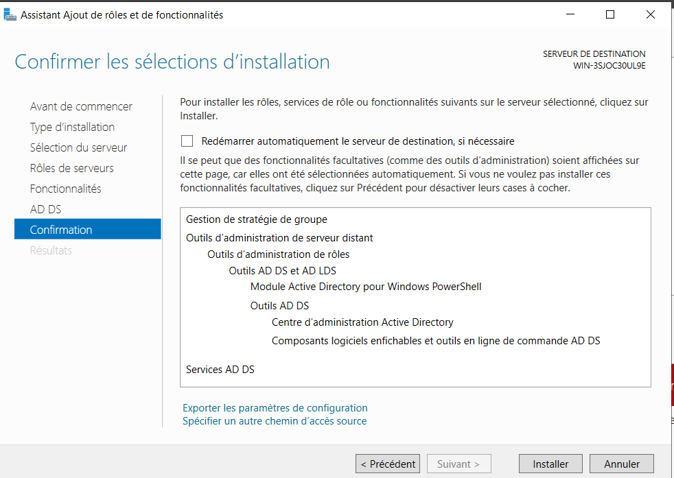

## Active Directory

Mise en place d'un domaine Active Directory sur Windows Server afin de centraliser l'administration des utilisateurs, des groupes et des ressources d'une infrastructure d'entreprise.

## 🎯 Objectif

L'objectif de cette partie est de mettre en place une infrastructure Active Directory Domain Services (AD DS) permettant de centraliser la gestion des identités et des ressources du réseau.

Le laboratoire reproduit une organisation informatique d'entreprise avec plusieurs services et groupes d'utilisateurs.

🖥️ Environnement
Windows Server
Active Directory Domain Services (AD DS)
DNS
Groupes de sécurité
Utilisateurs Active Directory
Unités d'organisation (OU)
Contrôleur de domaine
Windows 10 / Windows 7 clients

Le domaine utilisé dans le laboratoire est :

Domaine : fotsing.local
NetBIOS : FOTSING

L'organisation des utilisateurs et des groupes est structurée à l'aide d'unités d'organisation.
```
fotsing.local
│
├── OU-Utilisateurs
│   ├── RH
│   ├── Direction
│   ├── Informatique
│   ├── Comptabilité
│   └── Stagiaire
│
├── OU-Groupes
│   ├── OU-DL
│   └── OU-GG
│
├── OU-Ordinateurs
│
└── OU-Serveurs
```
⚙️ Installation d'Active Directory
## 1️⃣ Installation du rôle AD DS

Nous commençons par installer le rôle Active Directory Domain Services sur Windows Server.

Ce rôle permet au serveur de devenir un contrôleur de domaine et de fournir les services nécessaires à l'administration centralisée des utilisateurs et des ordinateurs.

<p align="center">  </p>
2️⃣ Promotion du serveur en contrôleur de domaine

Après l'installation du rôle AD DS, le serveur est configuré afin de devenir un contrôleur de domaine.

Le domaine du laboratoire est :

fotsing.local

Cette étape permet de créer l'environnement Active Directory qui sera utilisé par les postes clients et les différents services.

👥 Gestion des groupes
3️⃣ Organisation des groupes

Nous mettons en place différents groupes afin de faciliter la gestion des droits et des utilisateurs.

<p align="center">  </p>

L'utilisation des groupes permet notamment d'attribuer des permissions à plusieurs utilisateurs sans devoir configurer les droits individuellement.

👤 Gestion des utilisateurs
4️⃣ Ajout des utilisateurs dans les groupes

Les utilisateurs sont ensuite associés aux groupes correspondant à leur service ou à leur fonction.

<p align="center">  </p>

Cette organisation permet de simplifier l'administration des droits d'accès.

Par exemple :
```
Utilisateur
     │
     ▼
Groupe de sécurité
     │
     ▼
Permissions
     │
     ▼
Ressource
```
## 🗂️ Organisation avec les OU

Les utilisateurs, groupes, ordinateurs et serveurs sont organisés dans différentes Unités d'Organisation (OU).

Cette organisation permet notamment de :

structurer l'annuaire ;
appliquer des stratégies de groupe ;
déléguer l'administration ;
faciliter la gestion des utilisateurs ;
séparer les différents services de l'entreprise.
🔐 Gestion des droits

L'utilisation des groupes permet d'adopter une gestion centralisée des permissions.

Exemple :

```
OU Informatique
       │
       ├── Groupe GG-Informatique
       │        │
       │        ├── Administrateur
       │        └── Technicien
       │
       └── Ressources informatiques
```
L'utilisateur reçoit ses droits principalement à travers son appartenance aux groupes.

🧪 Tests

Une fois Active Directory configuré, plusieurs tests peuvent être réalisés.

Test 1 — Vérification du domaine
whoami

Permet de vérifier l'utilisateur actuellement connecté.

Test 2 — Vérification de la résolution DNS
nslookup fotsing.local

Permet de vérifier que le domaine peut être résolu par le DNS.

Test 3 — Vérification de la configuration réseau
ipconfig /all

Permet notamment de vérifier que le poste client utilise le serveur DNS du domaine.

Test 4 — Vérification de l'appartenance au domaine
systeminfo

Permet de consulter différentes informations concernant le système et le domaine.

## 📸 Résultats

Les captures présentées dans cette documentation montrent les différentes étapes de mise en place et d'administration de l'environnement Active Directory.

L'objectif est de démontrer non seulement l'installation du service, mais également son utilisation pour administrer les utilisateurs et les groupes.

## 🧠 Compétences démontrées
Administration Windows Server
Active Directory Domain Services
Contrôleur de domaine
Gestion des utilisateurs
Gestion des groupes de sécurité
Organisation des OU
DNS
Gestion centralisée des identités
Gestion des permissions
Administration système

<p align="center">
  
</p>

🔗 Navigation
[⬅️ Retour au projet principal](../../README.md)

[📁 audit de securite →](../audit de securite/README.md)