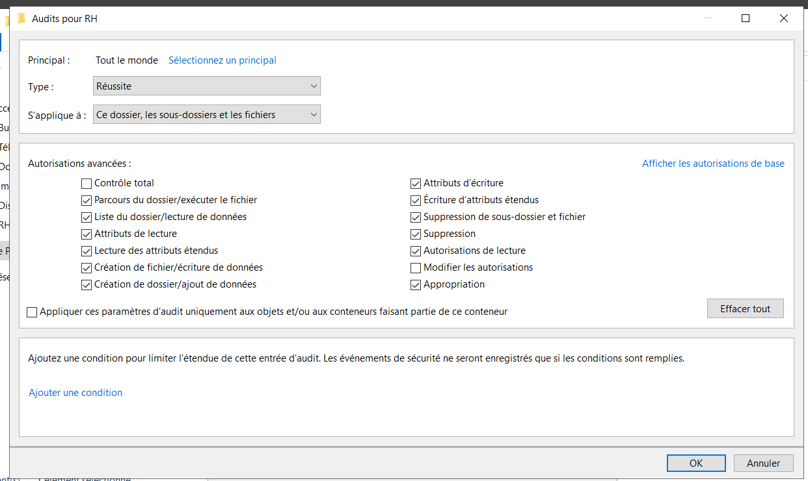
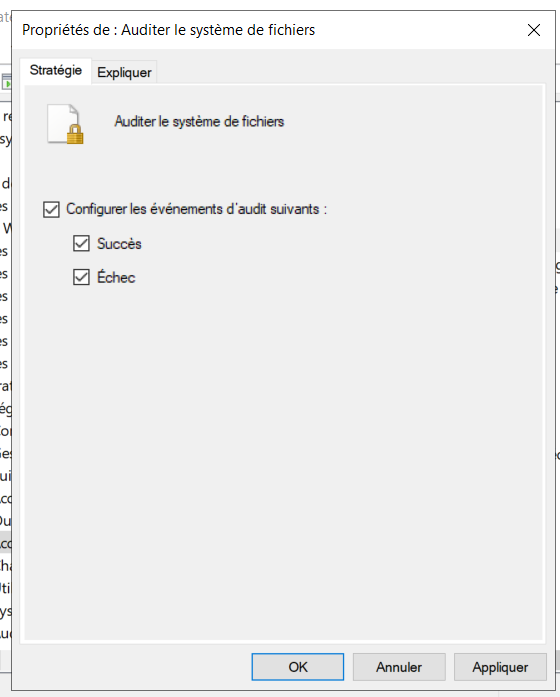
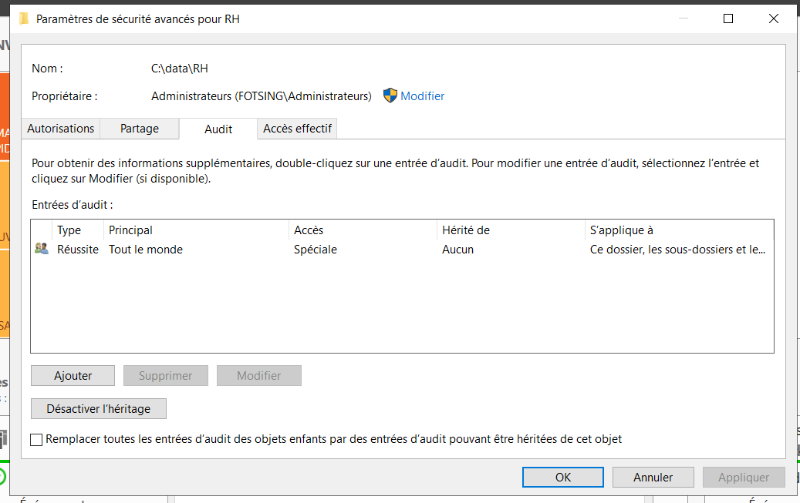
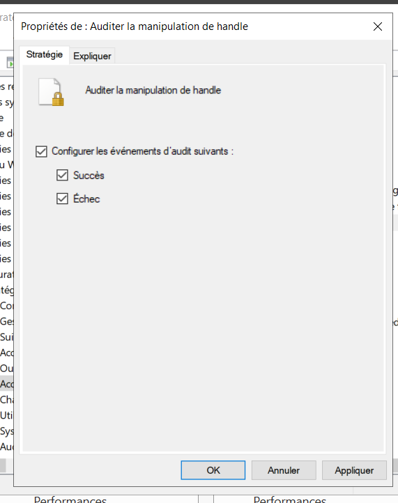
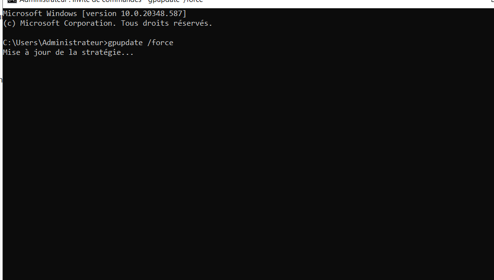

*** Audit de sécurité Windows ***

Mise en place de l'audit de sécurité Windows afin de journaliser et contrôler les accès aux fichiers et les actions effectuées sur les ressources du serveur.

## 🎯 Objectif

L'objectif de cette partie est de mettre en place un mécanisme d'audit de sécurité Windows permettant de suivre les actions effectuées sur les fichiers d'un serveur.

*** L'audit permet notamment d'identifier : ***
```
quel utilisateur a accédé à une ressource ;
quelle action a été effectuée ;
à quel moment l'action a été réalisée ;
quelle ressource a été concernée ;
les événements générés par Windows.
```

Le scénario est réalisé sur un serveur de fichiers Windows Server intégré au domaine Active Directory.

🖥️ Environnement
```
Windows Server
Active Directory
Serveur de fichiers
NTFS
Stratégies de groupe (GPO)
Observateur d'événements Windows
Audit des accès aux fichiers
Domaine fotsing.local
```

🏗️ Principe de fonctionnement

L'architecture de l'audit repose sur plusieurs éléments :

```
                    Active Directory
                           │
                           ▼
                    Stratégie GPO
                           │
                           ▼
                  Audit de sécurité
                           │
                           ▼
                   Serveur de fichiers
                           │
                           ▼
                    Dossier surveillé
                           │
                           ▼
                    Utilisateur
                           │
                           ▼
                 Accès / modification
                           │
                           ▼
                  Journal Windows
                           │
                           ▼
              Observateur d'événements
    
```

⚙️ Configuration de l'audit
1️⃣ Activation de l'audit sur le système de fichiers

Nous commençons par activer les paramètres d'audit permettant de surveiller les accès aux ressources du système de fichiers.

<p align="center">  </p>

Cette configuration permet à Windows de générer des événements lorsqu'une opération surveillée est réalisée sur un fichier ou un dossier.

2️⃣ Configuration des autorisations avancées d'audit

Nous configurons ensuite les paramètres avancés permettant de déterminer les catégories d'événements qui doivent être enregistrées.
<p align="center">  </p>

Cette étape permet de contrôler plus précisément les opérations qui doivent être journalisées.

3️⃣ Configuration des événements

Nous configurons les événements qui seront surveillés afin de pouvoir analyser les actions effectuées sur les ressources.

<p align="center">  </p>

Mise en place du scénario de test

4️⃣ Création du dossier de test

Afin de vérifier le fonctionnement de notre configuration, nous créons un dossier qui sera utilisé pour réaliser les tests d'accès.

<p align="center">  </p>

Nous pouvons ensuite effectuer différentes opérations sur cette ressource afin de générer des événements de sécurité.

5️⃣ Vérification de la configuration

Une fois la configuration terminée, nous pouvons passer à la phase de test.

<p align="center">  </p>

📝 Analyse des événements

6️⃣ Ouverture de l'Observateur d'événements

Nous ouvrons ensuite l'Observateur d'événements Windows afin d'analyser les événements générés par notre système d'audit.

<p align="center">  </p>

L'Observateur d'événements permet de consulter les journaux générés par Windows et d'identifier les opérations réalisées sur le système.

7️⃣ Identification de l'utilisateur

Nous pouvons retrouver l'utilisateur ayant accédé à la ressource surveillée.

<p align="center">  </p>
Cette information permet notamment de réaliser une traçabilité des accès aux ressources.

🔐 Audit des manipulations

8️⃣ Configuration de l'audit sur les manipulations

Nous configurons également l'audit permettant de surveiller les différentes opérations réalisées sur les fichiers et dossiers.

<p align="center">  </p>

L'objectif est de pouvoir identifier les actions réalisées sur les ressources surveillées.

🔄 Mise à jour des stratégies

9️⃣ Actualisation de la stratégie de groupe

Après avoir configuré les paramètres d'audit, nous mettons à jour les stratégies de groupe afin que les modifications soient prises en compte.

<p align="center">  </p>

Nous pouvons également utiliser :

gpupdate /force

Cette commande permet de forcer l'actualisation des stratégies de groupe sur le poste.

Tests réalisés

Le scénario de test suit le processus suivant :
```
Création du dossier
        │
        ▼
Modification / accès au fichier
        │
        ▼
Génération de l'événement
        │
        ▼
Ouverture de l'Observateur
d'événements
        │
        ▼
Recherche de l'événement
        │
        ▼
Identification de l'utilisateur
        │
        ▼
Analyse de l'action réalisée
```
🔎 Résultat

La configuration permet de mettre en place une traçabilité des accès aux ressources du serveur de fichiers.

Les événements générés par Windows peuvent ensuite être consultés dans l'Observateur d'événements afin d'analyser les opérations effectuées.

Ce mécanisme constitue une base importante pour la supervision et la sécurité d'une infrastructure Windows.

🧠 Compétences démontrées
```
Administration Windows Server
Active Directory
Stratégies de groupe (GPO)
Audit de sécurité Windows
Audit du système de fichiers
NTFS
Serveur de fichiers
Observateur d'événements
Analyse des journaux Windows
Traçabilité des utilisateurs
Gestion des événements de sécurité
gpupdate
```