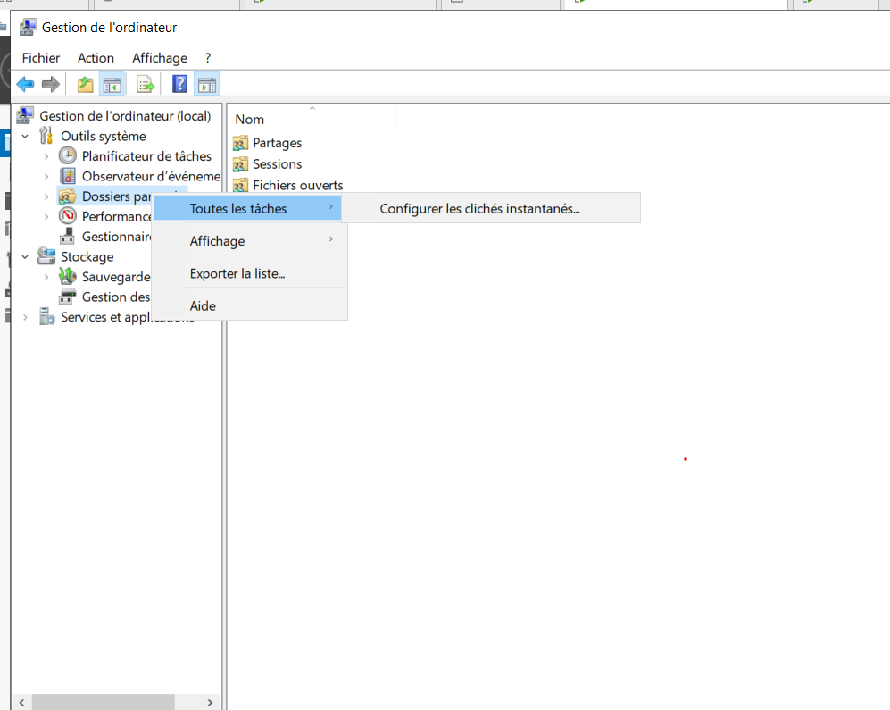
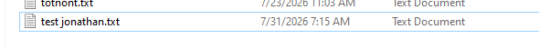
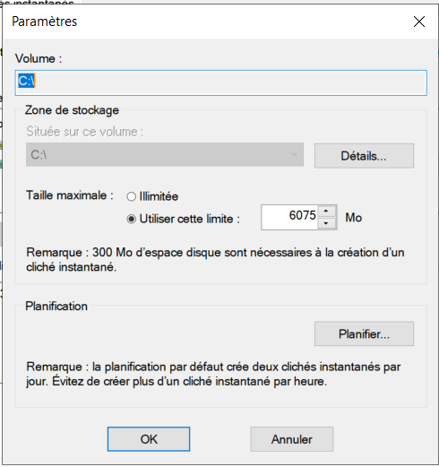
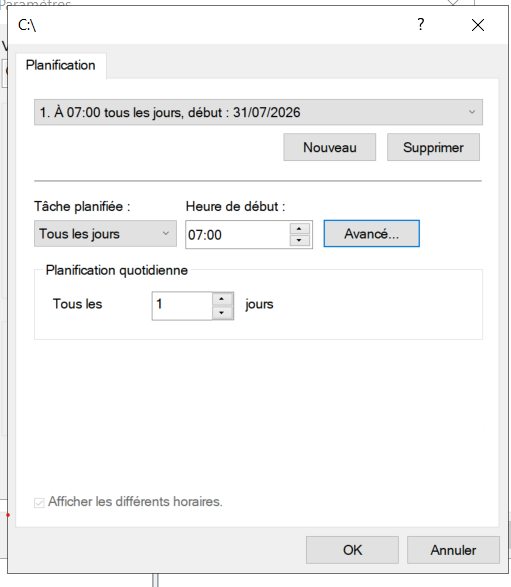

# 🕐 Shadow Copy / VSS

> Mise en place de Shadow Copy sur un serveur de fichiers
> Windows Server afin de permettre la restauration de versions
> précédentes des fichiers.

---

## 🎯 Objectif

L'objectif est de mettre en place Shadow Copy afin de permettre
aux utilisateurs de récupérer une version précédente d'un fichier
sans devoir restaurer l'intégralité du serveur.

---

## 🖥️ Environnement

- Windows Server
- NTFS
- Serveur de fichiers
- Volume de données
- Shadow Copy / VSS
- Active Directory

---

# ⚙️ Configuration

## 1️⃣ Configuration de Shadow Copy

Nous commençons par accéder aux propriétés du volume contenant
les données et configurons les clichés instantanés.

  

---

## 2️⃣ Création du dossier de test

Nous créons un dossier permettant de vérifier le fonctionnement
de Shadow Copy.

  

---

## 3️⃣ Définition de l'espace disque

Nous définissons l'espace maximal pouvant être utilisé pour
les clichés instantanés.

  

---

## 4️⃣ Planification

Nous configurons la planification des clichés instantanés.

  

---

# 🧪 Test de restauration

Nous effectuons ensuite une modification du fichier afin de
vérifier qu'une version précédente peut être récupérée.

  

---

## activation des clichés

Nous activons nos clichés instantané

  

---
## 🔄 Restauration
ici nous validons les clichés instantanés, Nous pouvons voir qu'il y'a eu une action

  

 

  

---
# ✅ Résultat

La fonctionnalité Shadow Copy permet de conserver des versions
précédentes des fichiers et de restaurer rapidement une donnée
modifiée ou supprimée.

---

# 🧠 Compétences démontrées

- Administration Windows Server
- NTFS
- VSS / Shadow Copy
- Serveur de fichiers
- Gestion des données
- Sauvegarde et restauration
- Dépannage

---

## 🔗 Navigation

[⬅️ Retour au projet principal](../../README.md)

[📁 Serveur de fichiers →](../serveur-fichiers/README.md)